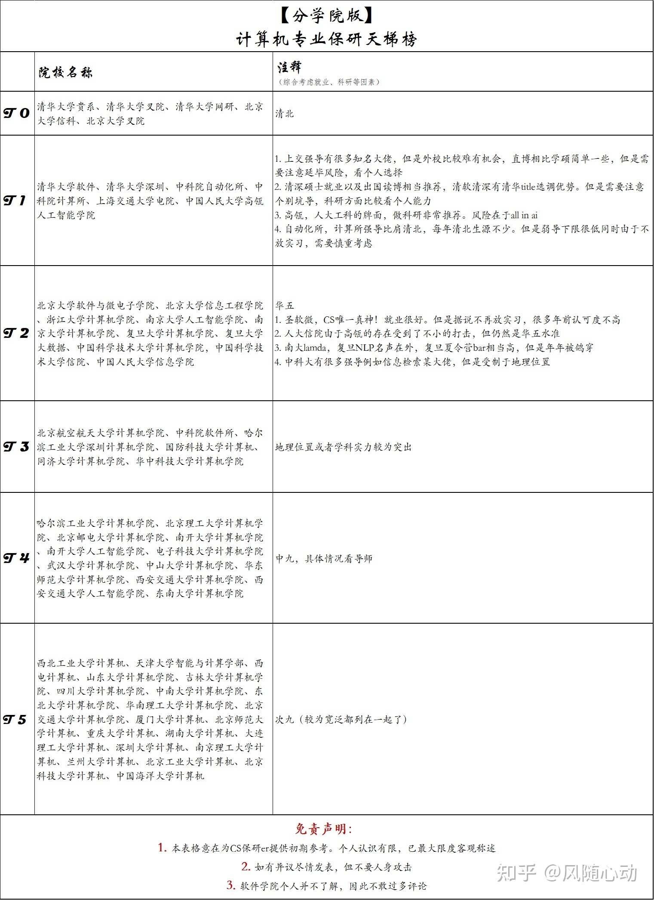
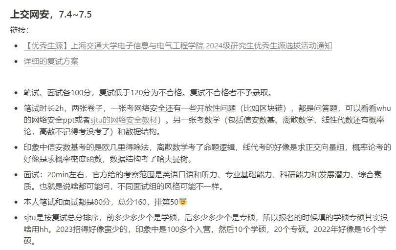

> 下面是基于知乎用户给出的CS保研天梯榜🪜

# 保研天梯榜

  

    
  

> 下面是个人收集的一些保研信息🙂【**仅供参考！**】

## 清华大学

| 院系           |      招生模式      | 备注 |
| :------------- | :----------------: | :--: |
| 智能产业研究院 | 需要线下work 1-2月 |   /   |
| 高等研究院     |   只要直博    |   /   |
| 叉院/网研/AI...     |   /    |   不敢碰瓷orz   |

>  bar比较高但有科研经历的门槛会适当降低，老师喜欢养鱼，且夏令营优秀营员数量极少，大致上是四进一的比率。**拿到优营不代表拿到offer**,取得优营只是有机会参加最后的综合面试，综合面试通过者才能拿到预录取offer。

## 北京大学

| 院系     |                        招生模式                         |                           考核方式                           | 备注 |
| :------- | :-----------------------------------------------------: | :----------------------------------------------------------: | :--: |
| (圣)软微     |                        **强com**                        | 在指定文章列表里阅读一篇文章，完成阅读报告，根据阅读报告决定最终入营名单 |   听说是夏令营不放实习 预推免放实习  |
| 智能学院 | **超弱com**，老师通过，后面就走流程 |                           23有机试                           |   /   |
| 叉院     |            **强com**，硕士不需要提前联系老师            |                              /                               |   /   |
| CS       |             **弱com**，提前联系老师有帮助             |                           23有机试                           |   只要机试不爆0，感觉纯看老师要不要   |

> 鼠鼠不敢碰瓷TPU，所以信息整理的很少

## 清华大学深研院

| 院系           |                招生模式                |             备注             |
| :------------- | :------------------------------------: | :--------------------------: |
| 大数据         |                   /                    |              /               |
| CS             | 不陶瓷根本不能入营，靠谱的老师直接开捞 | 机试+面试（英面+简历面） |
| AI             |                 没有机试                    |           /              |
| 电子与信息工程 |                   /                    |              /               |

整体来说：**弱com**==>**夏令营陶瓷**

> 有老师会捞人，并不多，**清深优营就是最终offer**

## 北京大学深研院

| 院系         |                        招生模式                         | 备注 |
| :----------- | :-----------------------------------------------------: | :--: |
| 信息工程学院 | **超弱com**，夏令营 **无机试**，老师通过，后面就是走流程 |   /   |

整体来说：**超弱com**==>**夏令营陶瓷很有用**

> 主要是搞cv，需要提前联系，得阅读该老师 **近两年的论文**，**写一个论文阅读报告**（3-5个优点和3-5个缺点，面试是英语+自我介绍+问答（屏幕共享，现写伪代码/算法/数学公式），**不咋捞人**

## 上海交通大学

| 院系 |                           招生模式                           |                   备注                   |
| :--- | :----------------------------------------------------------: | :--------------------------------------: |
| 网安 | **强com**，需要 **入营后** 联系老师完成双选（提前陶瓷没用，就算过了导师考核，也需要学院筛选入营） | 笔试、面试各100分，复试低于120分为不合格，24年超发优营（过120即优） |
| CS  |                     学科歧视，基本不让进                     |                    /                     |
| 软院 |                          **弱com**（硕士有待商榷）                           |                机试+面试                 |
| AI |                **弱com** 24年第一届，只有面试，优营即offer                    |               纯 **弱com** + **高优营率**                |

> 在电院下，CS和网安二选一，近年新增网研院，bar比网安低

  

    
  

## 复旦大学

| 院系            |  招生模式   |                         备注                         |
| :-------------- | :---------: | :--------------------------------------------------: |
| 计院（cs+网安） |  **强com**  |                  30%机试+60%面试+10%英面（24年只要rk1+2）                   |
| 大数据          | **弱com** | 考试对数学要求很高，入营比较容易（但好像也得前5%，24年更低） |
| 类脑            |      /      |                          bar也相对不是很高                           |
| 工研院          | **弱com** |               相对计院和信科 不是很卷                |
| 信工院          |  **强com**  |                       学硕很难（FDU都如此，专硕多但费用高）                       |

整体来说：**超强com**（仅针对硕士，直博 **弱com**） ==>**夏令营陶瓷无用** （可以多准备面试）

> 还是比较迷惑，感觉还是得联系一下导师（看珞珈晚邮的消息）/等预推免。冷门院系如果院前面没人报，可能有机会入营（但是要陶瓷！）

## 中国科学技术大学

| 院系   |             招生模式              | 备注                                    |
| :----- | :-------------------------------: | :----------------------------------------------------------- |
| 网安   | **强com**，优营后双选才算正式录取 | 考核只有面试，上午下午各一场，每场10min，考核内容包括英语、项目、数学、408等等。 |
| CS    |   **弱com**，学科歧视，基本不让进 | 机试+面试，面试合格要有老师接受获得优营（24年新增机试+不联系老师也能入营）                 |
| 大数据 | **强com**，**优营** 后进行导师选择 | 机试+面试，面试合格要有老师接受获得优营 |
| 信院 | **弱com**，**优营** 后进行导师选择 | 分 **6系** (无老师推荐很难入营)和 **10系** (必须老师推荐入营)，分开招生，**6系** 院面优营率80%+，主攻AI，难在双选 |

整体来说：**强弱com结合** ==>**夏令营建议陶瓷** （信院一定得陶瓷！！）
> 华五中对低rk鼠鼠最友好的学校！而且夏令营体验感会很好！

## 浙江大学

| 院系       |                     招生模式                      |    备注    |
| :--------- | :-----------------------------------------------: | :--------: |
| CS       |          **弱com**，针对 **直博**，需要完成暑期项目           |     /       |
| 软院       | **弱com**，完成分配的项目任务，考核结果满意就优营 | 海王营，不晒人 |
| 网安       |            **强com**，需要通过学院初筛            |       /     |
| 工程师学院 |             **强com**，优营必有offer              |       /     |
| 信工院     |                   只招 **博士**                    |     /       |

整体来说：**强弱com结合** ==>**夏令营建议陶瓷** 
> 只看专排成绩，且考核周期太长+大多地理位置不太行+部分优营无效力，性价比感觉不是很高

## 南京大学

| 院系               |                      招生模式                       |      备注      |
| :----------------- | :-------------------------------------------------: | :------------: |
| CS                 |                      **强com**，线上考试+机试（3道）+面试                      |      有acm/paper，低rk也能入营        |
| AI                 |                      **强com**                     |        有著名的Lamda实验室       |
| 软件所             |           计算机科学与技术系下属的实验室            | /  |
| 智能科学与技术学院 | **强com**，入营完交意向老师签字书，可以提前物色老师 | 机试+笔试+面试，很高bar（24年只要了rk1），但老师都很强|
| 软件学院           |             **强com**，联系老师作用不大             |   笔试+面试    |

整体来说：**超超强com** ==>**夏令营陶瓷无用** ，且得准备408

> 南大本部专硕无住宿且两年，但智技院专硕有住宿。面试主问专业知识且涵盖面广，需专门针对复习准备

## 中国人民大学

| 院系              |                          招生模式                           |
| :---------------- | :---------------------------------------------------------: |
| 高瓴 | **强com**，陶瓷基本没用，起到占坑作用，**优营** 之后联系老师。但是直博bar会很低 |
| 信息学院          |                     **强com**，bar较高                      |

整体来说：**强com** ==>**夏令营陶瓷基本无用** 

> 会签保密协议，不能透题，且老师面试过程中不能讨论交流，即无法捞人

## 中国科学院

| 院系     |                           招生模式                           |          备注           |
| :------- | :----------------------------------------------------------: | :---------------------: |
| 软件所   |               20名以内能进 强组难（rk5%没进）                |        组内方差大         |
| 信工所   | **弱com**，入营简单，入营后要选研究室，六个研究室再筛简历，筛完才能真正进入夏令营考核（**需要陶瓷**，并通过单独面试） |        组内方差大         |
| 计算所   | **弱com**，夏令营名单没用，老师只有一个招生名额，但是能提供入营机会，得获得老师的认可，通过考核，考核通过即被录取(**需要陶瓷**) | 笔试+机试+面试 最牛的是VIPL |
| 自动化所 | **强com**，面试考核，**优营+双选** 才会被录取（ **可以陶瓷** 来提前完成双选） |        组内方差较大         |

# 一些链接 
* [**中科大夏令营指南与答疑汇总**](https://ustc.gleamoe.com/guide/notification.html)
* [**保研攻略(From 南大软院)**](https://postgraduate-recommendation.readthedocs.io/zh-cn/latest/index.html#)
* [**保研文书模板**](https://zhuanlan.zhihu.com/p/615923570)
* [**CS保研DDL(实时版)**](https://cs-baoyan.github.io/cs-baoyan-ddl/)