# [**生成式模型**](./生成模型.pdf)

> 本质上是：**密度估计问题** ——从密度函数中采样一个点来生成样本 
> 目标是： 希望学习到一个模型$p_{model}(x)$，产生的样本分布与训练样本分布$p_{data}(x)$相近

## 生成式模型分类

  

    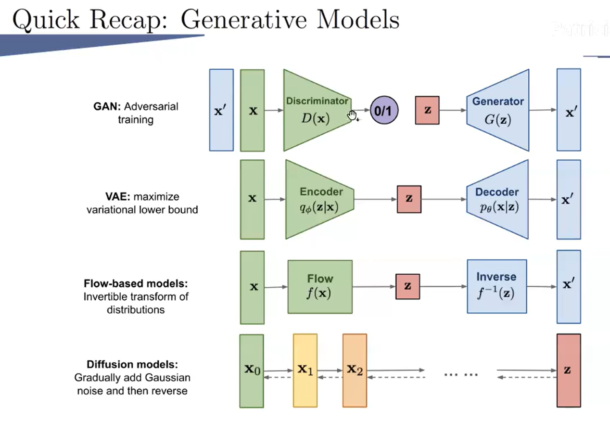
  

### GAN

  

    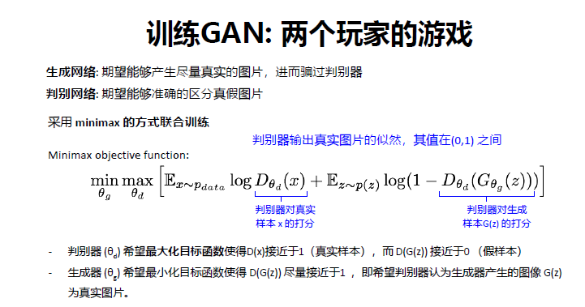
  

GAN是专门为了优化生成任务而提出的模型。生成模型的一大难点在于如何度量生成分布与真实分布的相似度。一般情况下，我们只知道这两个分布的采样结果，很难知道具体的分布表达式，因此难以找到合适的度量方法。GAN的思路是，把这个度量任务交给一个神经网络来做，这个网络被称为判别器(Discriminator)。GAN在训练阶段用对抗训练方式来交替优化生成器G(·)与判别器D(·)。整个模型的 **优化目标是上述的目标函数**。

上述公式直观地解释了GAN的原理：

* 判别器D(·)的目标是区分真实样本和生成样本，对应在目标函数上就是使目标函数的值尽可能大，也就是对真实样本x尽量输出1，对生成样本G(z)尽量输出0；
* 生成器G(·)的目标是欺骗判别器，尽量生成“以假乱真”的样本来逃过判别器的“法眼”，对应在目标函数上就是让目标函数的值尽可能小，也就是让D(G(z))也尽量接近1。

这是一个“MiniMax”游戏，在游戏过程中G(·)和D(·)的目标是相反的，这就是GAN名字中“对抗”的含义。通过对抗训练方式，生成器与判别器交替优化，共同成长，最终修炼为两个势均力敌的强者。

> 如果将判别器D(·)看作一个二分类器，对真实样本输出1，对生成样本输出0，D(·)的优化目标可以解释为最大化该分类问题的对数似然函数，即最小化交叉熵损失。这个看起来简洁又直观的定义，在理论上存在一些问题。
> 
> 简单来说，就是在训练的早期阶段，目标函数式无法为生成器提供足够大的梯度。这是因为，在一开始训练时，生成器还很差，生成的数据与真实数据相差甚远，判别器可以以高置信度将二者区分开来，这样$1og(1一D(G(z)))$达到饱和，**梯度消失**。

  

    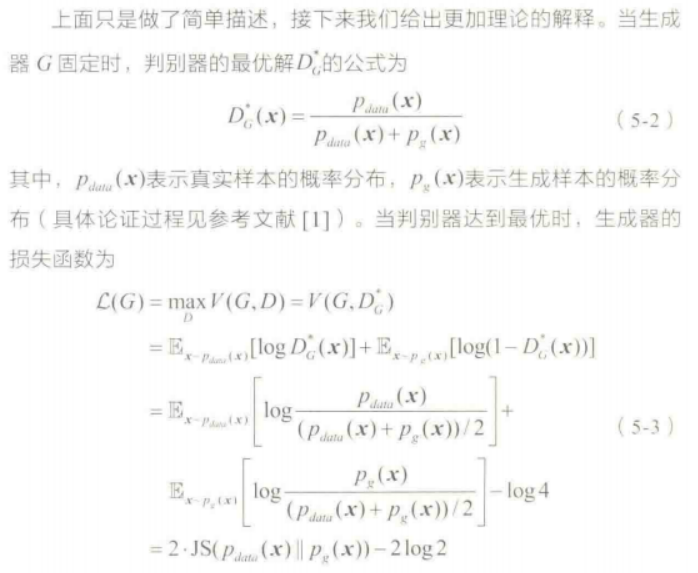
  

其中，JS是JS散度，和KL散度类似，用于度量两个概率分布的相似度，定义为：

  

    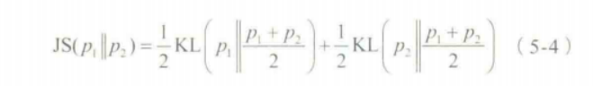
  

可以看到，JS散度的取值是非负的，当且仅当两个分布相等时取0，此时$L(G)$取得最小值-2log2。当判别器达到最优时，根据损失函数$L(G)$，此时生成器的目标其实是最小化真实分布与生成分布之间的JS散度。

随着训练的进行，判别器会逐渐趋于最优，所以生成器也会逐渐近似于最小化JS散度。然而，JS散度有一个特性：当两个分布没有重叠的部分或几乎没有重叠时，JS散度为常数（这可以根据JS散度的定义式(5-4)得到），为log2。

在GAN中，生成器一般是从一个低维空间中采样一个向量并将其映射到一个高维空间中，所以生成数据只是高维空间中的一个低维流形。同理，真实分布也是高维空间中的低维流形高维空间中的两个低维流形，在这样“地广人稀”的空间中碰面的几率趋于0，所以生成分布与真实分布是几乎没有重叠部分的。因此，在判别器很强的情况下，生成器的损失函数为常数，出现 **梯度消失** 问题！

于是，后面的人将生成器的损失函数修改为下式，在训练早期为生成器提供更大的梯度：

  

    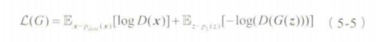
  

然而，上面的改进存在以下问题：

  

    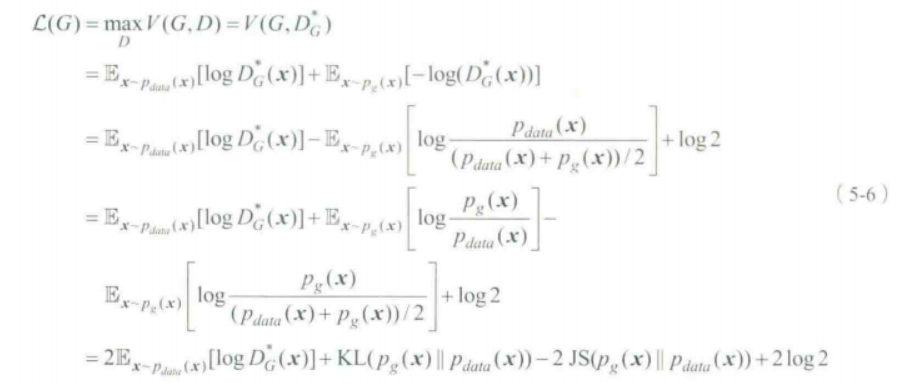
  

最小化损失函数相当于最小化$KL(p_g(x)||P_{data}(x))-2JS(p_g(x)||p_{data}(x))$。这就既要最小化生成分布与真实分布的KL散度（即减小两个分布的距离），又要最大化两者的JS散度（即增大两个分布的距离），这会在训练时造成 **梯度的不稳定** 。

另外，KL散度是一个非对称度量，因此还存在对不同错误惩罚不一致的问题。举例来说，当生成器缺乏多样性时，即当$p_g(x)$趋于0，$p_{data}(x)$趋于1时，$KL(p_g(x)||p_{data}(x))$ 对损失函数贡献趋近于0;而当生成器生成了不真实的样本时，即当$p_g(x)$趋于1，$p_{data}(x)$趋于0时，惩罚会趋于无穷大。真实数据的分布往往是高度复杂并且多模态的数据分布有很多模式，相似的样本属于一个模式。由于惩罚的不一致，生成器宁愿多生成一些真实却属于同一个模式的样本，也不愿意冒着巨大惩罚的风险去生成其他不同模式的具有多样性的样本来欺骗判别器，这就是所谓的 **模式坍塌!**

总的来说，GAN存在以下两个问题：

* 在判别器D(·)趋于最优时，存在 **梯度消失** 问题！
* 采用$-logD$来改进生成器时，存在 **训练梯度不稳定**，**惩罚不平衡导致的模式坍塌（即缺乏多样性）**， **不好判断收敛性** 以及难以评价生成数据的质量和多样性等。 

### VAE

  

    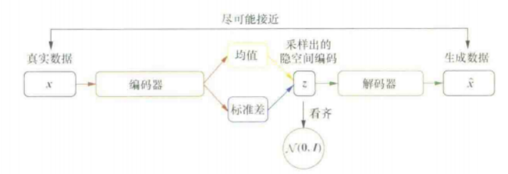
  

VAE是Kingma和Welling在2013年提出的。他们假设数据x由一个随机过程产生，该随机过程分为两步：先由先验分布$P_{θ^*}(z)$产生隐藏变量$z$，再由条件分布$P_{θ^*}(x|z)$产生数据$x$。这里的参数可以通过最大化数据似然来求得：

  

    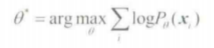
  

$P_{θ^*}(x)$可以表示为：

  

    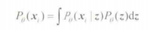
  

这样我们可以用采样法估计$P_{θ^*}(x)$，即：

  

    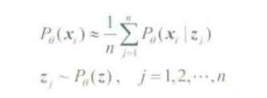
  

VAE的核心想法就是找到一个容易生成数据x的z的分布，即后验分布$Q_Φ(z|x)$，有了这个后验分布，如何优化似然函数$P_{θ}(x)$？这里我们使用变分推断，通过优化目标函数的下界来间接优化原始目标函数。考虑后验分布$Q_Φ(z|x)$应和真实的后验分布$P_Φ(z|x)$接近，二者之间的KL散度需要比较小，所以得到似然函数的下界：

  

    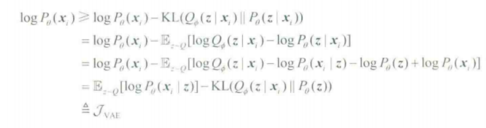
  

因为无法直接对似然函数$P_{θ}(x)$进行优化，所以在变分推断中通过不断 **优化下界** 来达到最大化$P_{θ}(x)$的目的。

  

    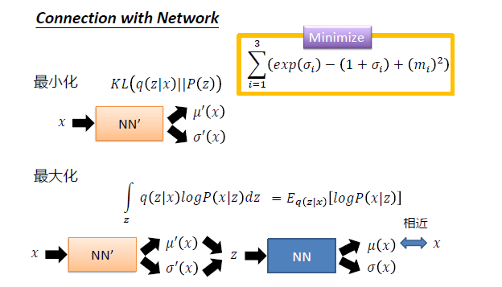
  

VAE其结构也是由编码器和解码器组成。VAE的主要优势在于能够 **产生新的隐向量$z$，进而生成有效的新样本** 。其原因是：VAE在编码过程中加入了一些限制，迫使编码器产生的隐向量的后验分布$q(z|x)$尽量接近某个特定分布（如正态分布）。VAE训练过程的优化目标包括重构误差和对后验分布$(z|x)$的约束这两部分。VAE编码器的输出不再是隐空间中的向量，而是所属正态分布的均值和标准差，然后再根据均值与标准差来采样出隐向量$z$。由于采样操作存在随机性，每一个输入图像经过VAE得到的生成图像不再是唯一的，只要$z$是从隐空间的正态分布中采样得到的，生成的图像就是有效的。

> **和AE比较：** AE在生成数据时只会模仿而不会创造，无法直接生成任意的新样本，这是因为AE在生成样本时用到的隐向量其实是真实样本的压缩编码，也就是说每一个生成样本都需要有对应的真实样本，AE本身无法直接产生新的隐向量来生成新的样本。

但是，VAE存在以下两个问题：

* 在VAE中，假设近似后验分布$Q_Φ(z|x)$是高斯分布形式，但实际应用中真实的后验分布$P_Φ(z|x)$不一定满足这个形式，它可能是任意的复杂形式。
* VAE以优化对数似然函数$1ogP_θ(x)$的下界$J(x)$为目标，但这个下界与真正要优化的原始目标函数可能有一定的距离。

> **Latent space：**
> 
> 在数据降维方面，Latent Space通过去除数据中的冗余信息和噪声，将高维数据降维到低维空间，从而简化了数据表示。 这种降维过程类似于数据压缩，但与传统的数据压缩方法不同的是，Latent Space更注重保留数据中的关键信息和结构。

### Flow-based models

补充一个数学知识：

  

    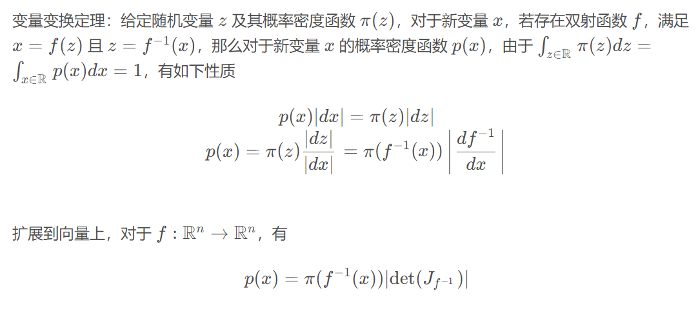
  

> 其中的J表示雅各比矩阵，在线性代数课程中有讲过

那么由变量变换定理，我们可以得到似然的等价形式：

  

    
  

不过要想一步做到，基本上不可能，所以可以将其分解为多步可逆的操作：

  

    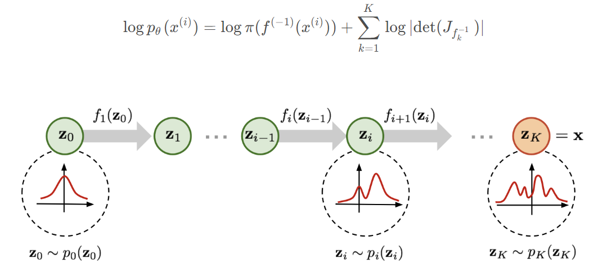
  

在训练过程中，我们只需要利用 f逆，而在推理过程中，我们使用 f 进行生成，因此对 f 约束为：f 网络是可逆的。这对网络结构要求比较严格，在实现时，通常要求 f 的输入输出是相同维度的来保证 f 的可逆性。这就是所有基于流模型的模型的设计思路。
> 设计一个f(x)，能够可逆，这个是最大的挑战!

### Diffusion models
> 更新于2024.7.31（持续更新ing）
#### DDPM

> wating for writing...

#### DDIM

> waiting for writing...

#### DDIM Inversion

  

    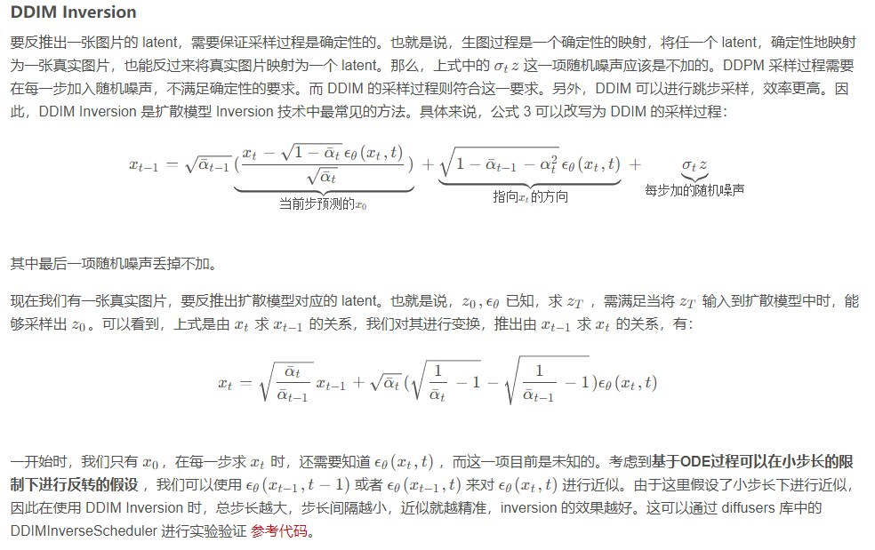
  

#### LDM

  

    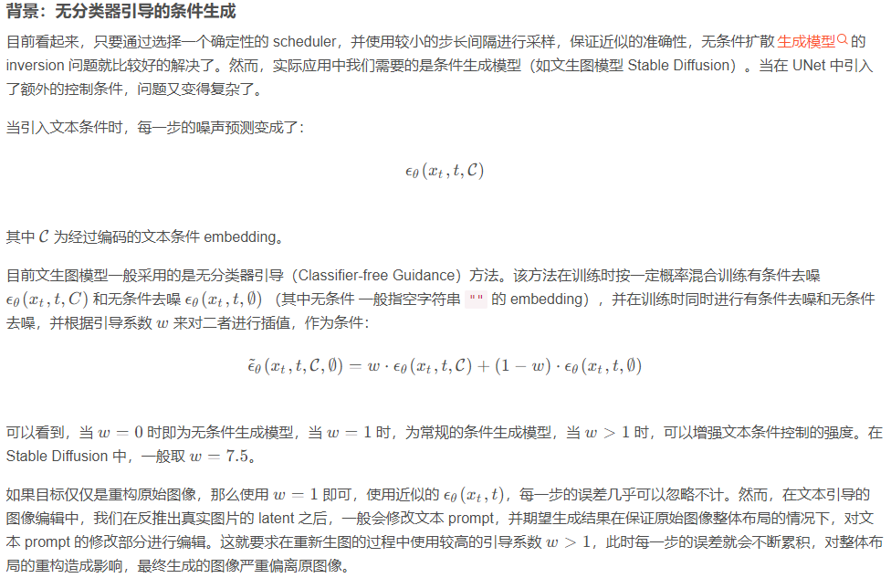
  

## 生成式模型核心原理

| **类型**    | **核心原理**    | **求解思路**        | **具体求解方法**        |
| :-----------: | :-----------: | :-----------: | :-----------: |
| GAN    | 生成对抗训练/最小化JS散度      | 最小化设计的LOSS A + B ，而这个LOSS等价于-2log2 + 2JS   | - A - B 就是0-1交叉熵损失，判别器目标是最小化这个交叉熵损失函数，生成器目标是最大化这个交叉熵损失函数（即最小化LOSS A + B） |
| VAE  | 最大化似然/最小化KL散度        | 求解最大化似然的一种下界 A - B          |设计了VAE模型，模型生成分布和真实分布的逼近程度为 A，模型的隐变量的分布和标准正太分布的逼近程度为 B，模型的训练目标为max A min B  |
| Flow-based models    | 最大化似然/最小化KL散度      | 求解最大化似然的等价形式 X          | X需要模型多步可逆，否则不等价，所以FLOW类方法都是设计一个巧妙的可逆的模型 |
| Diffusion models    | 最大化似然/最小化KL散度      | 求解最大化似然的另一种下界 C - D + E          | 设计了Diffusion模型，D是常量不用管，C和E类似，E表示为前向过程的分布和逆向过程的分布的KL散度，而前向过程的分布的方差和均值确定，故模型训练目标使逆向过程接近前向过程的分布即可（均值 方差） |
|  语言模型   | 最小化交叉熵      | 直接使用交叉熵损失函数     | 原理上任何模型都可以成为语言模型，只是效果好不好的问题，因为交叉熵损失函数可以直接算，也不用精巧的设计。 模型的好坏会影响交叉熵的最小值。模型越好交叉熵越小 |

## 生成式模型间对比

### GAN vs. VAE

* 在VAE的损失函数中，重构损失的目的是降低真实样本和生成样本之间的差异，而迫使隐向量后验分布接近正态分布，实际上是 **增加了生成样本的不确定性** ，两种损失相互对立。这与GAN一样，它们内部都存在对抗思想，只不过VAE是将两部分同步优化的，而GAN则是交替优化的。

* GAN的优化目标只涉及 **生成样本和真实样本之间的比较** ，没有VAE中对后验分布的约束。不同的是，GAN设计了判别器，并用对抗训练方式绕过了对分布间距离的度量，且在判断样本真假时不需要真实样本与生成样本一一对应，而在VAE中都需要二者一一对应才能计算重构误差。

* GAN没有像VAE那样从学习到的隐向量后验分布$q(z|x)$中获得生成样本$x$的能力，可能因此导致 **模式坍塌、训练不稳定** 等问题。另外，在VAE中隐向量空间是数据的压缩编码所处的空间，隐向量用“精炼”的形式表达了输入数据的特征。如果我们想在抽象的语义层次上对数据进行操控，比如改变一张图像中人的发色，直接在原始数据空间中很难操作，而VAE在隐空间的表达学习能力，使得可以通过在隐变量空间上的插值或条件性嵌入等操作实现对数据在语义层次上的操控。

> 其实理解了各个生成式模型各自原理，就懂其优缺点了

### GAN vs. Diffusion models