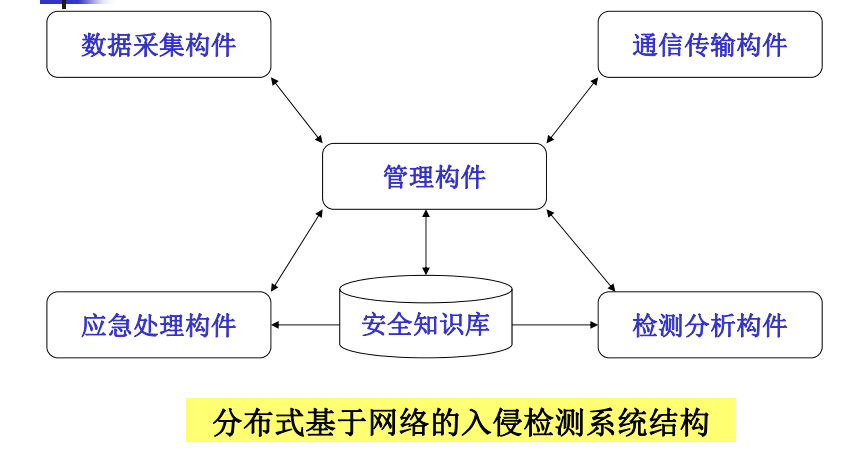

> 提供一个公开的[**复习资料地址**](https://sotawhu.cn/yuangpeng/303dd377bbb346649992e6808982b58a)
## 概念题常考察内容
### 缓冲区溢出
> 最好线下编程实现

### 欺骗攻击

#### 1.如何进行ARP欺骗以及如何检测和预防ARP欺骗（题目整理中有相关内容）

ARP欺骗是一种网络攻击技术，攻击者通过发送伪造的ARP（地址解析协议）消息，使得目标设备更新其ARP缓存，从而错误地将攻击者的MAC地址与合法的IP地址关联起来。这样，攻击者可以截获、篡改或阻断网络通信。

> 利用ARP协议的特性：当主机收到一个ARP应答包后，它并不会去验证自己是否发送过这个ARP请求，而是直接将应答包里的MAC地址与IP对应的关系替换掉原有的ARP缓存表里的相应信息

**进行ARP欺骗的步骤（题目整理P24）**

1. **获取目标IP地址和MAC地址**：攻击者需要知道目标设备的IP地址和MAC地址。
2. **发送伪造的ARP应答包**：向目标设备发送包含虚假MAC地址的ARP应答包，使目标设备的ARP缓存更新为攻击者的MAC地址。
3. **持续发送伪造ARP包**：为了保持欺骗的状态，攻击者需要持续发送伪造的ARP包，以防目标设备的ARP缓存更新为正确的MAC地址。

**检测ARP欺骗的方法：**

1. **检查ARP缓存**：定期查看设备的ARP缓存表，发现异常的MAC地址和IP地址绑定。
2. **网络流量监控**：使用Wireshark等工具监控网络流量，检测大量的ARP回复包或不正常的ARP通信。
3. **端口镜像**：在交换机上配置端口镜像，将所有流量复制到一个端口进行分析，识别可疑的ARP流量。
4. **主机入侵检测系统（HIDS）**：使用HIDS工具如OSSEC，实时监控和检测ARP缓存的变化。

  

    
  

**预防ARP欺骗的方法：**

1. **静态ARP表**：在关键设备上配置静态ARP表，手动绑定IP地址和MAC地址，避免动态ARP表被篡改。
2. **DHCP侦听**：使用访问控制确保主机仅使用分配给它们的 IP 地址，并且只有经过授权的 DHCP 服务器可以访问。
3. **动态ARP检测（DAI）**：在交换机上启用DAI功能，验证ARP包的真实性，防止伪造的ARP包通过。
4. **加密通信**：使用VPN或SSL/TLS等加密协议保护网络通信，即使攻击者截获数据包，也无法解密内容。
5. **安全工具**：部署防火墙、入侵检测系统（IDS）和入侵防御系统（IPS），实时监控和防御ARP欺骗攻击。

#### 2.ICMP可以用来做ping，也可用来做traceroute，他们的功能不一样，他们的功能有什么区别

**相似点：**

1. **协议**:都使用ICMP协议（尽管Traceroute在一些系统上可能使用UDP）。
2. **用途**:都用于网络诊断和故障排除。
3. **测试网络连接**:都能够确认目标主机是否在线和可达。
4. **网络延迟**:都能够测量网络延迟（RTT）。

**不同点：**

* **目标和用途**:

   **Ping**：主要用于测试两个主机之间的连通性和测量往返时间（RTT）。适用于快速验证网络连接和响应时间。 
   **Traceroute**：用于跟踪数据包从源主机到目标主机所经过的路径，并显示路径上的每一跳。适用于详细分析网络路径和定位网络问题。
   
* **数据包类型和工作原理**:

**Ping**：发送ICMP Echo请求（ICMP类型8），目标主机响应ICMP Echo应答（ICMP类型0）。 
**Traceroute**：发送带有递增TTL（生存时间）的ICMP Echo请求（在Windows上）或UDP包（在Linux和其他系统上）。每一跳路由器返回ICMP超时消息（ICMP类型11），目标主机返回ICMP Echo应答或端口不可达消息（UDP）。

* **信息量和结果**:

**Ping**：提供简单的连通性和RTT信息。通常只返回目标主机的响应时间和数据包丢失情况。
**Traceroute**：提供详细的路径信息，包括每一跳的IP地址和响应时间。能够显示数据包经过的所有中间路由器，并标识出潜在的网络瓶颈或故障点。

* **命令输出**:

**Ping**：输出包含目标主机的响应时间和丢包率，通常为连续多个请求的统计信息。
**Traceroute**：输出包含每一跳的IP地址和响应时间，显示从源主机到目标主机的完整路径。

#### 3.PPT上关于邮件欺骗攻击的内容比较少,但是上课时举过很多邮件有关的例子,包括如何去反邮件欺诈

> **邮件欺骗的原理**: P161 

邮件欺骗攻击与防范措施

**1. 钓鱼邮件（Phishing Emails）**

**例子**：银行钓鱼：假冒银行发送邮件，要求用户验证账户信息或更新密码；社交媒体钓鱼：假冒社交媒体平台，要求用户重新登录或重设密码。

**防范措施**：

- **教育与培训**：定期培训员工和用户，提高对钓鱼邮件的警觉性，了解钓鱼邮件的常见特征（如紧急语言、异常链接、奇怪的发件人地址）。
- **双因素认证（2FA）**：启用双因素认证，增加账户保护层。
- **反钓鱼工具**：使用反钓鱼软件和浏览器插件，实时检测和阻止钓鱼网站。
- **邮件过滤**：配置邮件网关，自动过滤和标记可疑邮件。

**2. CEO欺诈（Business Email Compromise, BEC）**

**例子**：假冒CEO或高层管理人员，指示财务部门进行紧急汇款或转账；伪造供应商邮箱，要求修改付款账户信息。

**防范措施**：

- **多级审批流程**：对于大额转账或敏感操作，实施多级审批和验证。
- **电话验证**：通过非电子邮件渠道（如电话）确认紧急请求的真实性。
- **员工培训**：教育员工识别和应对BEC攻击，提高警觉性。

**3. 恶意附件（Malicious Attachments）**

**例子**：伪装成PDF、Word文档或压缩包的恶意附件，一旦打开会感染受害者的设备；假冒合法软件更新，诱使用户下载并安装恶意软件。

**防范措施**：

- **附件扫描**：配置电子邮件网关和防病毒软件，自动扫描和过滤恶意附件。
- **限制执行权限**：限制用户设备上附件和软件的执行权限，减少恶意软件的影响。
- **定期备份**：定期备份重要数据，以防勒索软件攻击。

**4. 欺诈性发票（Fraudulent Invoices）**

**例子**：假冒供应商发送虚假发票，诱使公司支付不合法款项；伪造付款请求，修改银行账户信息。

**防范措施**：

- **财务审核流程**：实施严格的财务审核和批准流程，核实供应商和发票的真实性。
- **供应商验证**：定期与供应商确认账户和付款信息。
- **员工教育**：教育财务人员识别欺诈性发票，提高警觉性。

**5. 伪造品牌邮件（Brand Spoofing Emails）**

**例子**：假冒知名品牌发送促销或奖励邮件，诱骗用户点击恶意链接或提供个人信息；假冒IT支持，诱骗用户下载恶意软件。

**防范措施**：

- **品牌认证技术**：使用DMARC、DKIM和SPF等品牌认证技术，验证邮件的真实性。
- **链接检查**：教育用户检查邮件中的URL链接是否可信，避免点击可疑链接。
- **邮件过滤**：配置邮件客户端的过滤和报警系统，自动识别和标记伪造品牌邮件。

### 网络监听

Windows抓包技术 vs. Unix抓包技术？

> WinPcap vs. BPF&libpcap

#### WinPcap（Windows Packet Capture）

**概述**： WinPcap是Windows平台上用于网络数据包捕获和网络监控的库，提供低层次的网络访问，类似于Unix系统中的libpcap。

**工作原理**：
WinPcap通过安装一个网络驱动程序，以捕获所有流经网络接口的数据包。它包括一个动态链接库（DLL），提供用户态应用程序接口，用于编写抓包和注入数据包的程序。

**优点**：

- **易用性**：WinPcap的安装和使用相对简单，提供了丰富的示例和文档。
- **广泛应用**：被广泛用于各种网络分析工具，如Wireshark、Nmap等。
- **良好的性能**：能够高效地捕获和处理大流量的数据包。

**缺点**：

- **平台限制**：只能在Windows操作系统上使用。
- **更新停滞**：WinPcap已经停止维护，最新的分支是Npcap，继续提供类似功能。
- **安全风险**：需要以管理员权限运行，可能带来安全风险。

#### BPF（Berkeley Packet Filter）和libpcap（Portable C Library for Packet Capture）

**概述**： BPF是Unix系统中的一个数据包过滤机制，libpcap是一个跨平台的网络数据包捕获库，提供了与BPF配合使用的API。

**工作原理**：

**BPF**：在内核空间中运行，通过过滤表达式，只捕获用户感兴趣的数据包，减少用户态和内核态之间的数据传输量，提高性能。 
**libpcap**：提供用户态的API，使应用程序能够使用BPF进行数据包捕获和过滤。

**优点**：

- **跨平台支持**：libpcap支持各种Unix和类Unix操作系统，包括Linux、BSD、macOS等。
- **高效过滤**：BPF在内核态执行过滤，提高了数据包捕获的效率和性能。
- **广泛使用和支持**：libpcap是许多网络分析工具的基础，如tcpdump、Wireshark等。
- **安全性**：通过非特权模式运行，可以在不使用超级用户权限的情况下进行数据包捕获。

**缺点**：

- **复杂性**：BPF和libpcap的使用和配置相对复杂，尤其是对于不熟悉Unix系统的用户。
- **平台依赖**：虽然libpcap是跨平台的，但BPF的实现依赖于具体的操作系统。

### VPN

**重点圈的是IPSec** PPTP和L2TP属于比较老且成熟的技术 现在流行的是IPSec 所以这部分内容需要进行关注（三种VPN隧道协议的比较）

> VPN隧道协议比较分析

  

    
  

​	PPTP、L2TP和IPsec是三种常见的VPN隧道协议，它们在安全性、速度、兼容性和设置复杂度上有显著的差异:
​

* PPTP（Point-to-Point Tunneling Protocol）是一种较老的VPN协议，使用MPPE加密。其安全性较低，容易受到攻击，因此不适合用于传输敏感数据。然而，PPTP的加密强度较低，使得其速度相对较快，适合对速度要求较高但安全性要求不高的场景。PPTP的兼容性非常好，几乎所有的操作系统和设备都支持PPTP，配置也非常简单，只需要提供用户名、密码和服务器地址。

* L2TP（Layer 2 Tunneling Protocol）本身不提供加密，需要与IPsec结合使用来确保数据安全。L2TP/IPsec提供强大的加密和认证机制，安全性较高，适合传输敏感数据。由于L2TP和IPsec的双重封装和强加密机制，L2TP/IPsec的速度比PPTP稍慢。虽然配置较为复杂，但主要操作系统和设备都支持L2TP/IPsec。设置L2TP/IPsec通常需要配置IPsec安全策略、密钥或证书，并且在防火墙上开放多个端口。

* IPsec（Internet Protocol Security）是一种独立的协议套件，专门用于保护IP网络通信。IPsec通过对数据包进行加密和认证，提供高度的安全性。它可以与多种隧道协议（如L2TP）结合使用，也可以单独使用。IPsec的安全性非常高，适合需要高安全性的应用。由于强大的加密和认证机制，IPsec的速度会受到一些影响，但通常可以通过硬件加速和优化配置来提高性能。IPsec的设置较为复杂，需要详细配置安全策略、密钥管理和认证机制，但它提供了高度的灵活性和安全性。

### 防火墙

#### 1.两种防火墙的实现技术方式，一种是数据包过滤，一种是应用层代理，两种的运作方式以及优缺点是不同的

**数据包过滤防火墙**

运作方式主要是基于OSI模型的网络层和传输层工作。它通过检查数据包的源IP地址、目的IP地址、源端口、目的端口以及协议类型来决定是否允许数据包通过。数据包过滤防火墙的规则集由管理员预先定义，这些规则确定了哪些类型的数据包可以通过防火墙，哪些类型的数据包会被阻止。

数据包过滤防火墙的优点包括：

- **性能高**：由于仅检查数据包头部信息而不深入分析数据内容，数据包过滤防火墙处理速度快，对系统资源的占用较少。
- **透明性**：对于用户和应用程序透明，不需要进行额外的配置或修改。

然而，数据包过滤防火墙也有其缺点：

- **有限的安全性**：数据包过滤防火墙只能基于数据包头部的信息做出决策，无法检测和阻止应用层的攻击（如SQL注入或跨站脚本攻击）。
- **规则管理复杂**：随着网络规模和复杂性的增加，维护和管理大量的过滤规则变得困难。

**应用层代理防火墙**

也被称为代理服务器，工作在OSI模型的应用层。它通过在客户端和目标服务器之间充当中介，检查并过滤所有通过的应用层数据。客户端与代理服务器建立连接，代理服务器再与目标服务器建立新的连接。所有的数据流都通过代理服务器进行检查和过滤，这使得应用层代理防火墙能够深入分析数据内容，并基于特定应用协议（如HTTP、FTP等）做出安全决策。

应用层代理防火墙的优点包括：

- **高安全性**：能够检查和过滤应用层的数据内容，可以防御许多高级攻击，如SQL注入、跨站脚本攻击和恶意软件传输。
- **日志记录详细**：提供详细的日志记录和监控，能够记录用户活动和访问的具体内容，便于审计和分析。

但是，应用层代理防火墙也有一些缺点：

- **性能较低**：由于需要深入检查和处理应用层数据，代理防火墙的处理速度较慢，对系统资源的占用较高。
- **配置复杂**：需要为不同的应用协议进行配置，并可能需要对客户端和服务器进行额外的配置和修改。

### 入侵检测

#### 1. 基于主机的IDS有什么优点, 基于网络的IDS有什么优点, 他们面临的主要问题是什么（PPT上有）

  

    
  

> 动态技术

**基于主机的IDS（HIDS）**

**优点**：

1. **细粒度检测**：HIDS可以监控操作系统层面的活动，如文件系统、注册表、系统日志和应用程序日志，能够检测到细微的异常行为。
2. **加密流量检测**：因为HIDS运行在主机内部，可以看到所有未加密的数据，甚至是加密通信，从而能够检测加密流量中的威胁。
3. **针对特定主机的防护**：提供针对性防护，可根据主机的具体环境和应用程序进行配置和优化。
4. **内核级别的活动监控**：能够检测到系统调用、进程行为和内核模块的加载等低层次的活动，提供深层次的安全检测。

**缺点**：

1. **资源消耗**：HIDS运行在主机上，会消耗主机的CPU、内存和存储资源，可能影响主机的性能。
2. **易被绕过**：如果攻击者获得了管理员权限，可能会禁用或绕过HIDS。
3. **管理复杂**：需要在每台主机上单独部署和管理，增加了维护和管理的复杂性。
4. **日志量大**：由于监控的细粒度，会产生大量的日志数据，需要有效的日志管理和分析机制。

**基于网络的IDS（NIDS）**

**优点**：

1. **广泛覆盖**：NIDS可以监控整个网络中的流量，只需部署在关键网络节点，就可以覆盖多个主机，提供全局视角。
2. **低资源占用**：NIDS独立于监控的主机运行，不会消耗被监控主机的资源，对网络性能的影响比较小。
3. **检测速度快**：由于NIDS在网络边界处运行，可以快速检测和响应网络攻击。
4. **易于管理**：通常只需在网络的关键节点（如网关、路由器）部署和管理，减少了维护工作量。

**缺点**：

1. **加密流量检测困难**：NIDS无法解密传输中的加密流量，无法检测到通过加密通道的攻击。
2. **数据量大**：需要处理大量的网络数据流量，可能会导致数据丢失或误报/漏报。
3. **检测深度有限**：由于只能看到网络层和传输层的流量，难以检测到应用层的细粒度攻击。
4. **容易被逃避**：高级攻击者可以通过分段传输、变形攻击等手段绕过NIDS的检测。

**主要问题**

**基于主机的IDS（HIDS）面临的主要问题**：

1. **性能影响**：因为HIDS在主机上运行，会占用系统资源，影响主机的性能。
2. **复杂管理**：需要在每台主机上单独部署和维护，增加了管理复杂性。
3. **攻击绕过**：如果攻击者获得了高权限，可能禁用或绕过HIDS。

**基于网络的IDS（NIDS）面临的主要问题**：

1. **加密流量检测**：无法检测加密的数据流量，导致检测盲点。
2. **高数据流量处理**：需要处理大量的数据流量，容易导致性能瓶颈和误报/漏报。
3. **应用层攻击检测**：难以检测应用层的细粒度攻击，只能看到网络层和传输层的流量。
4. **规避技术**：攻击者可以使用多种技术绕过NIDS的检测，如分段传输和变形攻击。

  

    
  

  

    
  

  

    
  

#### 2.入侵检测系统(IDS)与入侵防御系统(IPS)（只有CJS的PPT上有）

**入侵检测系统（IDS）**

**功能**：1. 监控和检测：IDS主要用于监控网络或系统中的活动，检测异常行为或已知攻击模式。它通过分析数据流量和系统日志来发现潜在的安全威胁。2. 报警：一旦检测到可疑活动，IDS会生成警报通知管理员，但不采取自动化防御措施。

**类型**：1. 基于主机的IDS（HIDS）：安装在个别主机上，监控该主机的活动和日志。2. 基于网络的IDS（NIDS）：部署在网络节点，监控通过该节点的网络流量。

**优点**：1. 非侵入性：IDS不影响正常的数据流和网络性能。2. 详细日志记录：提供详细的检测日志，有助于事后分析和取证。

**缺点**：1. 反应速度：由于只是报警系统，响应时间依赖于管理员的反应速度。2. 误报和漏报：可能产生误报或漏报，需要不断调优规则和策略。

**入侵防御系统（IPS）**

**功能**：1. 检测和预防：IPS不仅能检测网络或系统中的异常行为，还能实时采取措施阻止这些行为。2. 自动化响应：IPS能够自动阻断、丢弃或重置恶意连接，防止攻击成功。

**类型**：1. 基于网络的IPS（NIPS）：部署在网络节点，实时监控和干预网络流量。2. 基于主机的IPS（HIPS）：安装在个别主机上，监控和防御针对该主机的攻击。

**优点**：1. 自动化防御：能够自动响应并阻止攻击，减少了对管理员干预的依赖。2. 实时保护：提供实时的威胁防护，有效减少安全事件的影响。

**缺点**：1. 潜在的性能影响：由于实时检测和干预，可能对网络性能造成影响。2. 误阻断风险：存在误阻断正常流量的风险，需要精细调整规则和策略。

**区别**

1. **反应机制**：**IDS**：被动监控和检测，生成报警通知管理员。**IPS**：主动防御，实时阻止和干预可疑活动。
2. **部署位置**：**IDS**：可以部署在网络的任何位置，通常在防火墙后面。**IPS**：通常部署在网络边界或关键节点，以便实时干预流量。
3. **对系统的影响**：**IDS**：对网络性能影响较小，因为只是监控和报警。**IPS**：可能对网络性能有影响，因为需要实时处理和阻断流量。

### WEB安全

#### 1.web服务端的安全的保护方式和客户端的安全的保护方式（只有CJS的PPT上有！！！）

**Web服务端的安全保护方式**

1. **使用HTTPS**：确保所有传输的数据通过加密连接（HTTPS）进行，防止数据在传输过程中被窃取或篡改。
2. **输入验证**：对用户输入进行严格验证和过滤，防止SQL注入、跨站脚本（XSS）和其他注入攻击。使用预编译语句（Prepared Statements）和参数化查询（Parameterized Queries）。
3. **身份验证和授权**：实施强身份验证机制，如多因素认证（MFA）。确保用户有适当的权限访问资源，使用角色和权限管理系统。
4. **安全的会话管理**：使用安全的会话标识符，并确保会话标识符在每次登录时都重新生成。设置会话超时，并在用户注销时清除会话。
5. **数据加密**：对存储在服务器上的敏感数据进行加密，包括用户密码和个人信息。使用强加密算法，如AES。
6. **安全更新和补丁管理**：定期更新服务器软件、操作系统和所有依赖项，及时应用安全补丁。
7. **Web应用防火墙（WAF）**：部署WAF来检测和阻止恶意流量，防御常见的Web攻击，如SQL注入、XSS和跨站请求伪造（CSRF）。
8. **日志记录和监控**：实施全面的日志记录，监控所有用户活动和系统事件。定期审计日志以检测和响应异常行为。
9. **访问控制**：限制和控制对服务器和数据库的访问，仅允许必要的访问权限。使用防火墙和网络隔离技术来保护关键资源。
10. **安全配置**：禁用不必要的服务和功能，确保服务器和应用的配置遵循安全最佳实践。

**Web客户端的安全保护方式**

1. **使用最新的浏览器**：确保使用最新版本的浏览器，因为它们包含最新的安全补丁和改进。
2. **安全的编码实践**：避免在客户端代码中暴露敏感信息。使用安全的编码实践防止DOM注入和其他客户端攻击。
3. **内容安全策略（CSP）**：实施CSP来防止XSS攻击，通过限制哪些资源可以加载和执行。
4. **跨站请求伪造（CSRF）防护**：使用CSRF令牌来保护用户免受CSRF攻击，确保每个请求都包含唯一的、不可预测的令牌。
5. **输入验证和输出编码**：在客户端验证用户输入以提高用户体验，但不要依赖客户端验证作为唯一手段。使用适当的输出编码来防止XSS攻击。
6. **安全的本地存储**：对存储在浏览器中的数据（如LocalStorage和Cookies）进行加密，防止敏感信息泄露。使用HttpOnly和Secure属性保护Cookie。
7. **强密码策略**：鼓励用户使用强密码，提供密码强度指示器，并实施密码策略，如最小长度和复杂性要求。
8. **防范点击劫持**：使用X-Frame-Options HTTP头部来防止点击劫持攻击，确保网页不能被嵌入到框架中。
9. **避免混合内容**：确保所有资源都通过HTTPS加载，避免混合内容警告，这可以防止中间人攻击。
10. **使用安全的第三方库和框架**：选择维护良好并定期更新的第三方库和框架，避免使用过时或不安全的组件。

> 【**真题**】针对一个B/S架构的web应用，请构建一个安全防护方案，要求能够保障前后端应用的安全性并论述其可能遭受的攻击及其对应的防护原理

#### 2. 除了WEB上的攻击之外，还有包括SQL注入，这也是在应用层经常发生的攻击，它能干什么？

**SQL注入的威胁和影响**

1. **数据泄露**：攻击者可以访问和窃取数据库中的敏感信息，如用户密码、个人信息、财务数据等。
2. **数据篡改**：攻击者可以修改、删除或插入数据库中的数据，导致数据完整性被破坏。
3. **权限提升**：攻击者可以利用SQL注入获得更高权限的访问，甚至是数据库管理员权限，从而全面控制数据库。
4. **拒绝服务（DoS）**：攻击者可以通过注入大量复杂的查询或删除操作，使数据库过载，导致应用程序无法正常运行。
5. **后门植入**：攻击者可以在数据库中创建恶意的存储过程、触发器或表，作为后门，长期控制和利用系统。

**SQL注入攻击的防护措施**

**1. 使用预编译语句（Prepared Statements）和参数化查询**：

- **防护原理**：预编译语句和参数化查询将SQL代码与数据分离，确保用户输入不会被解释为SQL代码，从根本上防止SQL注入。

**2. 输入验证和过滤**：

- **防护原理**：对用户输入进行严格的验证和过滤，确保输入符合预期格式，不包含恶意字符或SQL关键字。
- **实现步骤**：使用正则表达式验证输入；拒绝包含SQL保留字和特殊字符的输入。

**3. 最小权限原则**：

- **防护原理**：为应用程序分配最小必要权限，限制数据库用户的权限，防止攻击者利用SQL注入获得更高权限。
- **实现步骤**：创建专用数据库用户，仅授予必要的SELECT、INSERT、UPDATE、DELETE权限；禁止应用程序用户执行DROP、ALTER等DDL操作。

**4. 数据库错误信息隐藏**：

- **防护原理**：在应用程序中捕获和处理数据库错误，防止将详细的错误信息返回给用户，从而避免泄露数据库结构和SQL语句。

**5. 使用ORM框架**：

- **防护原理**：ORM（对象关系映射）框架如Hibernate、Entity Framework等，通过自动生成SQL语句和管理数据访问，减少手写SQL代码，从而降低SQL注入风险。
- **实现步骤**：使用ORM框架进行数据访问和操作；遵循框架的最佳实践，避免直接执行原生SQL查询。

**6. 实施Web应用防火墙（WAF）**：

- **防护原理**：WAF可以实时监控和过滤HTTP请求，检测并阻止SQL注入攻击。
- **实现步骤**：部署WAF解决方案，如ModSecurity、AWS WAF；配置和更新WAF规则，检测和防御SQL注入攻击模式。

**7. 安全代码审查和渗透测试**：

- **防护原理**：通过定期的安全代码审查和渗透测试，发现和修复潜在的SQL注入漏洞。
- **实现步骤**：进行静态代码分析，检查SQL注入漏洞；定期进行渗透测试，模拟攻击者行为，发现和修复安全漏洞。

### 访问控制技术

操作系统安全等级（只有CJS的PPT上有！！！）
> 可以结合访问控制技术来问

---

## 论述题/简答题常考察内容

> 简答题中会是比较复杂的问题

* 1.HTTPS会话劫持的原理 

* 2.交换式以太网中如何进行监听   

* 3.对于BS架构服务端应该如何保证安全，浏览器端应该如何保证安全

* 4.缓冲区溢出的原理是什么，如何阻止缓冲区溢出
> 所谓的阻止只需要让能成功使缓冲区溢出中任意一个条件不成立即可，比如地址随机化/代码执行保护

* 5.安全漏洞的评价标准–CVSS的评分标准，评分标准中对漏洞有哪些种视角，如何评价一个漏洞是高危的漏洞

* 6.如何设置口令是相对安全的
> 题目整理中有
* 7.防火墙章节中的网络结构图
> 不提供结构图，提供情景，比如有一个企业/校园网的需求），需要构建网络拓扑图，然后为其设置防火墙的相应的规则

