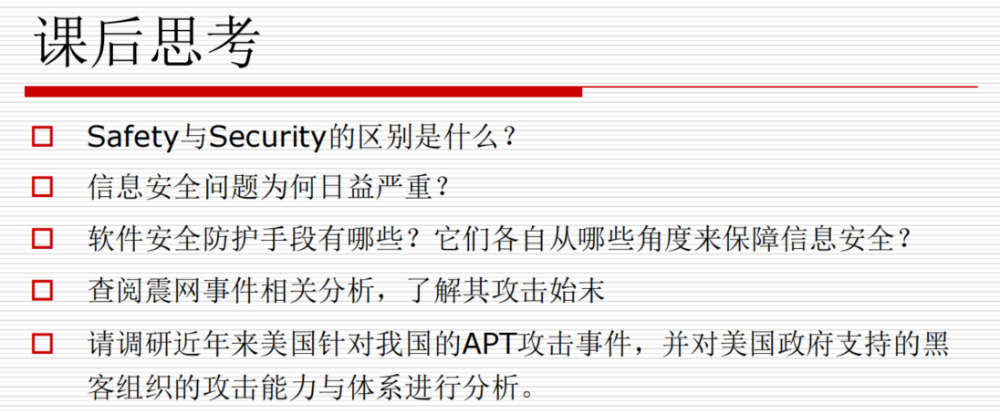
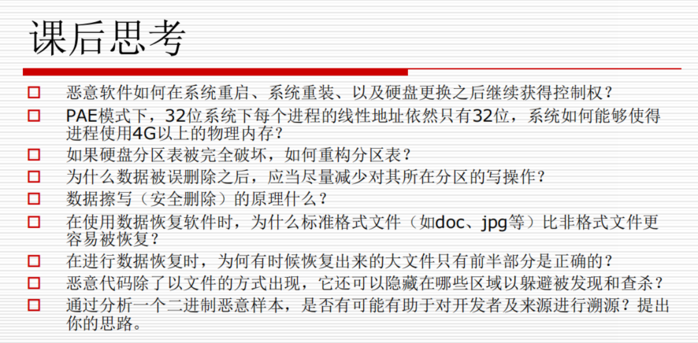
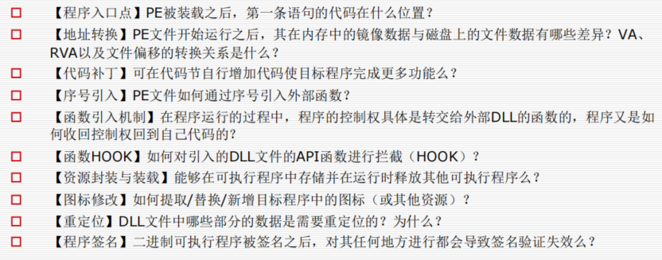
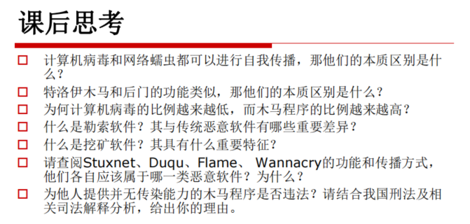
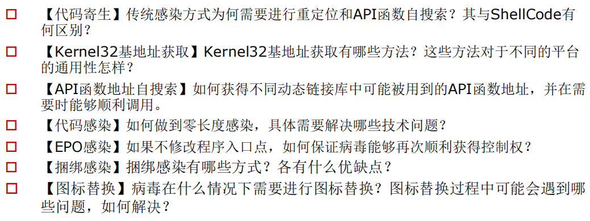
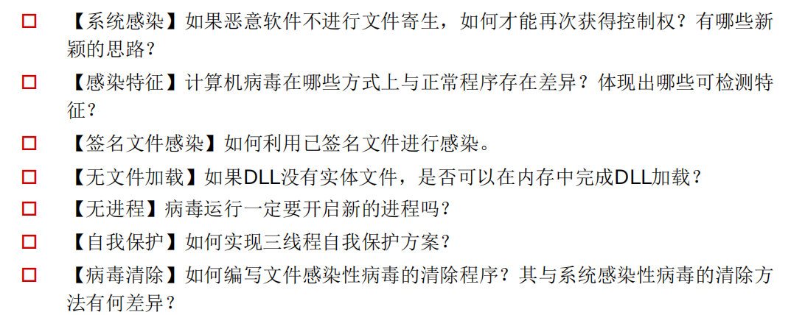
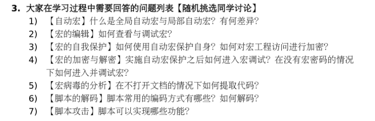
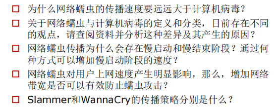
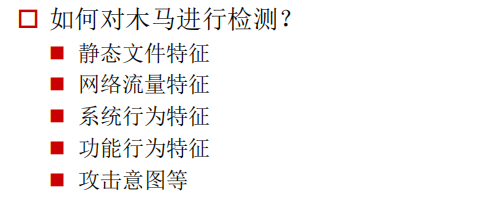

> 无偿提供一份小组合作整理的[**资料**](./期末问答整合.pdf)
>  
> **鸣谢**：yy、lmz、lsm、ywt、sty

> 以下内容为从PPT/MOOC中截取的课后思考题
### 软件安全概述
  

    
  

### 磁盘结构与文件系统

  

    
  

### PE文件结构与计算机病毒

  

    
  

> [**函数导出+DLL补丁**] 给你一个DLL文件(如系统的kernel32.dl),如何快速定位指定函数(如GetProcAddress)的RVA地址。是否可以修改该DLL使得之后其他程序调用该DLL特定函数时先执行自己的弹框代码？

### 恶意代码

  

    
  

### PE病毒

  

    
  

  

    
  

### 宏病毒与脚本病毒

  

    
  

### 网络蠕虫

  

    
  

> **MOOC上有讲**

### 木马与后门

  

    
  

> **APT攻击与远控木马**（MOOC内容）

### 恶意软件检测技术
> **MOOC上有讲**
